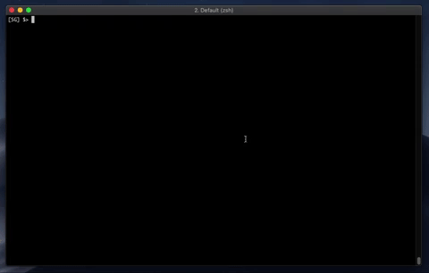

# filler
A program that can battle on the filler game 
## demo
</img>
## Built with
C language
## Installing
- Git clone the repository
- Compile it with `make`
## Make it work
- Move the sgalasso.filler file to players/
- Run `./filler_vm -m maps/map01 -p1 players/sgalasso.filler -p2 players/[other_player]`
## Author
Simon Galasso
